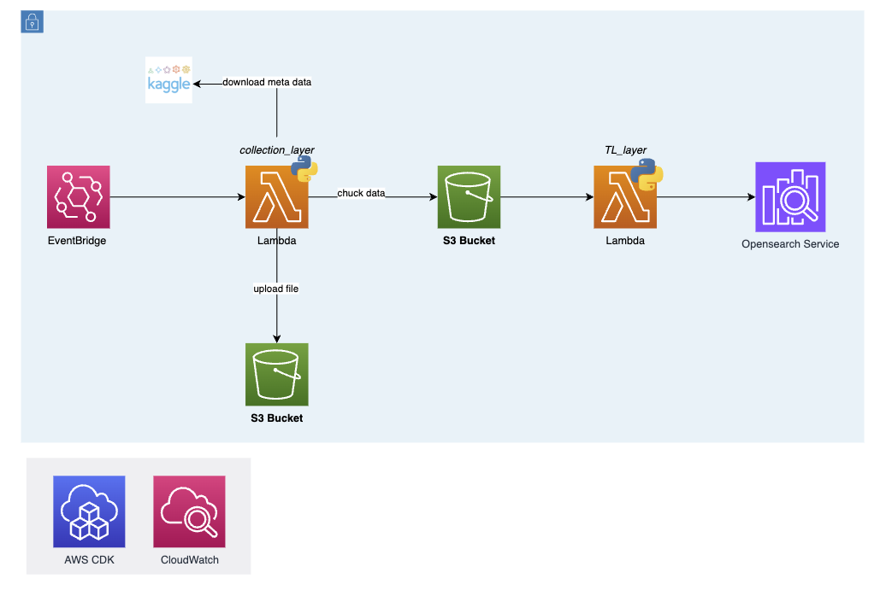

# arxiv-pipeline

一個基於 AWS Lambda 的自動化 arXiv 論文資料處理 pipeline，用於收集、處理並索引 arXiv 論文元資料到 OpenSearch。

## 架構概述

此專案採用無伺服器架構，包含以下主要組件：

- **Collection Layer**: 從 Kaggle 下載並處理 arXiv 元資料
- **Data Process Layer**: 轉換並索引資料到 OpenSearch
- **OpenSearch**: 提供論文搜尋與分析功能
- **AWS CDK**: IaC, 用於部署相關 aws 服務

## 專案資料夾結構

```
arxiv-pipeline/
├── app.py                          # CDK 應用程式入口 (可忽略)
├── pyproject.toml                  # Python 專案配置
├── pipeline_cdk/                   # 處理 aws 服務部署, 定義該專案相關之 aws 服務
│   └── pipeline_cdk_stack.py
├── collection_layer/               # 資料收集層
│   ├── arxiv_metadata.py           # 主要邏輯
│   ├── Dockerfile                  
│   └── utils/                      
├── data_process_layer/             # 資料處理層
│   ├── arxiv_metadata.py           # 主要邏輯
│   ├── Dockerfile                  
│   └── utils/                     
├── create_index_with_mapping/      # OpenSearch 索引初始化
│   └── main.py                     # 建立索引與預先定義好的 mapping
└── tests/                          # 測試檔案(由CDK 自動建立)
```

## 前置需求

- Python 3.12+
- AWS CLI 已配置
- Docker (用於本地開發測試)
- Node.js (用於 AWS CDK)
- uv (用於管理 python library)

## Architecture 
***

整體運作流程
1. 透過 EventBridge 定期觸發 Collection Layer 的 Lambda 服務。 (預計每日可觸發一次, 避免來源資料更新頻率不如預期)
2. Collection Layer Lambda 服務啟動後，從 S3 下載原始資料，並進行初步的資料清理(去除重複)，最後將處理後的資料上傳至另一個 S3 存儲桶，供 Data Process Layer 使用。
    - 2-1. 每次會先進行 metadata 的更新時間檢查，若無新資料則不進行後續處理。
    - 2-2. 會進行資料去重，避免重複索引相同論文。(依據 update_date)
    - 2-3. 進行資料切分，避免單次處理過多資料導致 Lambda 超時或資料異常導致錯誤。
    - 2-4. 最後會存放來源資料並標註時間，供後續比對、異常確認與 recovery。
3. 由 S3 觸發 Data Process Layer 的 Lambda 服務，開始對上傳的資料進行轉換與寫入資料庫。

## Architectural and processing design considerations
1. 使用 Lambda 分層架構：將資料收集和處理分離為獨立的 Lambda 函數，確保單一職責原則，便於維護和擴展。
2. 使用 S3：利用 S3 的高可用性和擴展性，作為 Lambda 函數之間的資料交換媒介，減少耦合，並可留存資料供後續異常確認與 recovery。
3. OpenSearch 索引：預先定義 mapping 優化查詢效能，同時可保留彈性以應對未來需求變更。
    - e.g. 如果後續期刊影響因子、引用次數、CORE 排名等資訊需要加入索引，則可利用 OpenSearch 的動態 mapping 功能自動新增欄位。
    - e.g. 論文推薦系統，可利用 OpenSearch 的 vector search 功能，將論文標題/摘要轉為向量並建立向量索引。
4. 目前資料量約 200 萬筆(約 4 ~ 5GB)，資料量對於 Opensearch 而言，並不算大，且下游需求目前僅為每週的儀表板更新，頻率較低，因此並未規劃先進行統計計算之類似 OLAP 的資料庫。如後續查詢效率或資料量大幅增加，會依據下游需求評估。
5. 目前該架構，並無自動恢復的措施，只有在 Lambda 內部進行錯誤處理並記錄錯誤日誌。若需要更高的可靠性，可以考慮加入以下機制：
    - 使用 CloudWatch 警報監控 Lambda 函數的錯誤率，及時通知相關人員進行處理。
    - 參考 DLQ (Dead Letter Queue) 概念，在 Lambda 函數失敗時，將失敗的事件發送到 SQS 隊列，並定期檢查該隊列以重新處理失敗的事件。
    - 可設計每週的資料量檢查機制，若資料量異常(資料量比對或資料最新時間)，則觸發警報通知相關人員進行檢查。

## Any assumptions made throughout your implementation
- 假設 arXiv 的資料格式不會頻繁變動，且能夠穩定地從指定來源獲取。
- 假設 arXiv 的更新頻率不會超過每日一次。
- 假設目前的資料量和更新頻率能夠被 Lambda 函數在預設的執行時間內處理完畢。

## Challenges
- 資料量過大導致 Lambda 超時：透過資料切分和分批處理來解決。
- 原先預期 kaggle 下載的資料與文件提供的 GCP storage 的文件格式相同，但實際上有些欄位缺失，導致資料來源取得邏輯錯誤。
- 原先使用 lambda + layer 的方式進行資料處理，但因為層級限制，導致無法使用某些第三方庫，後來改為將所有依賴打包到 Docker 映像中。
